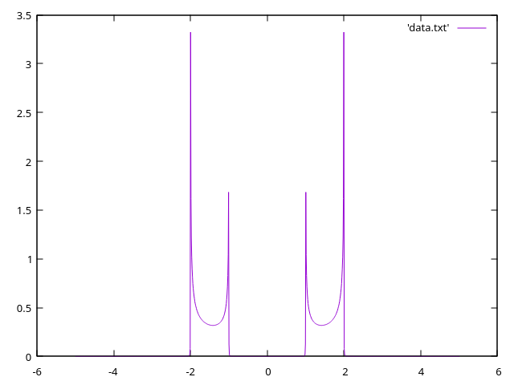

# A basic rundown of `gnuplot`

## Simple plot:
```
plot sin(x)
```

## Plot data file with 1st column along `x` and 2nd as `y`:
### Scatter Plot
```
plot 'data.txt' using 1:2 w p
```
### Line Plot
```
plot 'data.txt' using 1:2 w l
```
### Line & Points
```
plot 'data.txt' using 1:2 w lp
```

## For `png` graph:
```bash
gnuplot plotpng.gnu
```
## For `png` graph:
```bash
gnuplot plotpdf.gnu
ps2pdf plot.ps
```



